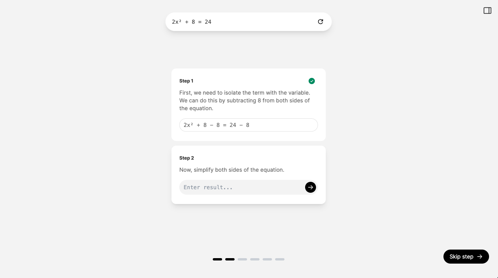

# Math Tutor demo using Structured Outputs

A simple Math Tutor demo built with [Next.js](https://nextjs.org/docs), leveraging [Structured Outputs](TODO: ADD LINK) with the OpenAI Chat Completions API to display structured UI components.

In this demo, the user can input a math problem and go through the solution step by step.
<br/>
<br/>


## Demo Setup

### 1. Clone repo

```shell
git clone https://github.com/openai/structured-outputs-demo.git
cd structured-outputs-demo
```

### 2. Set your [OpenAI API key](https://platform.openai.com/api-keys)

```shell
export OPENAI_API_KEY="sk_..."
```

(or in `.env.example` and rename it to `.env`).

### 3. Install dependencies

If you don't have pnpm already installed, run

```shell
npm i -g pnpm
```

Then install dependencies with pnpm:

```shell
pnpm install
```

### 4. Run

```shell
pnpm dev
```

The app will run on [http://localhost:3000](http://localhost:3000).

## Overview

This demo illustrates how Structured Outputs can be used in the Chat Completions API to generate user experiences with pre-defined UI components.

You can use this project to get familiar with Structured Outputs and play around with a working example.

To see what's happening behind the scenes, you can toggle the sidebar (top right corner) and see the json object returned by the Chat Completions API call.

## How it works

### API call

The Chat Completions API call can be found in `api/math_tutor/route.ts`. It uses a prompt and a json schema defined in `api/math_tutor/config.ts`.

The result is then used in the main page to display the structured solution steps and the final answer.

### Main Components

- `ProblemCard`: The component where users input their math problems. It includes a form to submit the problem and handles the initial state of the user input.

- `Solution`: This component fetches the solution for the given problem using the API. It manages the state of the solution, including the steps, user answers, and the status of each step. It also handles the display of the solution steps and the final answer.

- `StepComponent`: This component displays individual steps of the solution. It handles user interactions, such as submitting an answer or moving to the next step.

- `Stepper`: A navigation component that shows the progress through the solution steps and allows users to skip steps or view the next one.

- `Sidebar`: Displays the raw JSON response from the OpenAI API.
